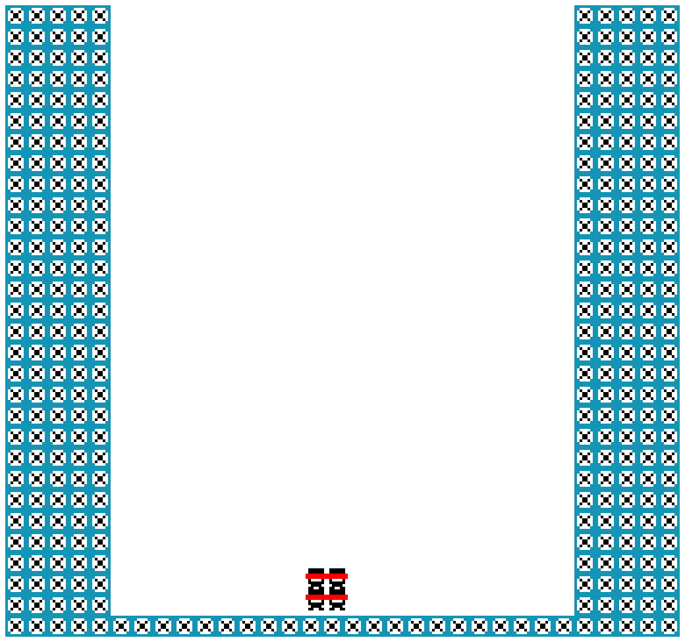

# Go For The Claw

Author: Jing Chung

Design: As a toy in the claw machine, being captured is the only way out. Hope you can find your Andy.

Screen Shot:

How Your Asset Pipeline Works:

1. Serialize assets into a game.asset file using /dist/processor.
The code of the processor is at the repository: https://github.com/Jing20Chung/15666-Game1-AssetProcessor.git

1.1. Parse sprite_sheet.png. Get tile, palette of each 8 * 8 grid.

    The way I parsed sprite_sheet is to sacrifice one pixel at the upper-right corner and use it as the disabled color to distinguish different sprites. By walking through the pixels, whenever it encounters a color that is not the disabled color, it starts to scan 8 * 8 grid (row: [start-start+8), col: [start-start+8)).

    In the inner loop:
    First, collect all the colors and put them into a vector. Throw exception if the found more than 4 colors. 
    
    Second, sort the color vector by defining a custom comparison function to be able to check if there is an existing palette in the all_palette vector. If this is a new palette, try to add into all_palette vector. Throw exception if the size of all_palette is greater than 8 (PPU's limitation). Get the corresponding index of the palette for later usage.

    Third, use this sorted palette to build tile map of this grid. Set the color of this pixel to the disable color to avoid dulplicated scan.
    
    Finally, store the infomation of tile index and palette index into struct SpritePiece for further usage.

1.2. Parse color_coding.png. Use this file to associate sprites with color, this is for generating background data. 

    I want to build background using the SpritePiece that is built previously, and also want to build map based on the png so I can design level by drawing and let the program genreate it. (Although the pipeline is working, it turns out that I have run out off time Q..Q)
    It's 8 * 8 based parsing (tile based). First, mark each tile in a different color in the color_coding.png file. Then associate SpritePiece with the color based on the position.

1.3. Parse level_map.png. This file is color-coded, use previous built color-coding map to generate background data.

    Again, it's tile-based parsing, when it encounters a color, it gets the tile and palette information from SpritePiece map by looking up the sprite piece's index using color_coding map. After getting the information, it combines those into PPU's format for background (palette_index << 8 | tile_index).

1.4. Parse group_color_coding.png. Collect the tile and palette in the same color to generate sprite. 

    In this way, a sprite can have multiple tiles. Also calculate position offset for each tile to let game can move all the hardware sprites and preserved their relative position. (This might be able to combine with the color coding mentioned above, but I haven't modify it.) 

    First, collect all the tile index and position that is in the same color. Because I use the same way to walk through the png, it ensures the index is the same as SpritePiece. Also, for the name mapping, I keep the color in order by using another vector to record the color's order.

    After collected all the color mapping data, then we can start to walk through all the color and put the tile index and palette index into SpriteInfo struct. 

    For the offset, I track the size of this sprite by memorizing the min and max position of row and column to be able to get the lower-center pivot coordinate and use that to calculate all the offsets for all the tiles.

    Finally, associate the name read from name_mappint.txt with SpriteInfo.

2. Deserialize data at runtime.

    All the data are written into game.asset using provided read_write_chunk.cpp methods. So at runtime, I deserialized data and put let Sprites struct to construct them into desired format.

How To Play:

The controls use the arrow keys, and the goal is to reach the claw, which will drop down randomly to grab toys within a limited time.

This game was built with [NEST](NEST.md).

